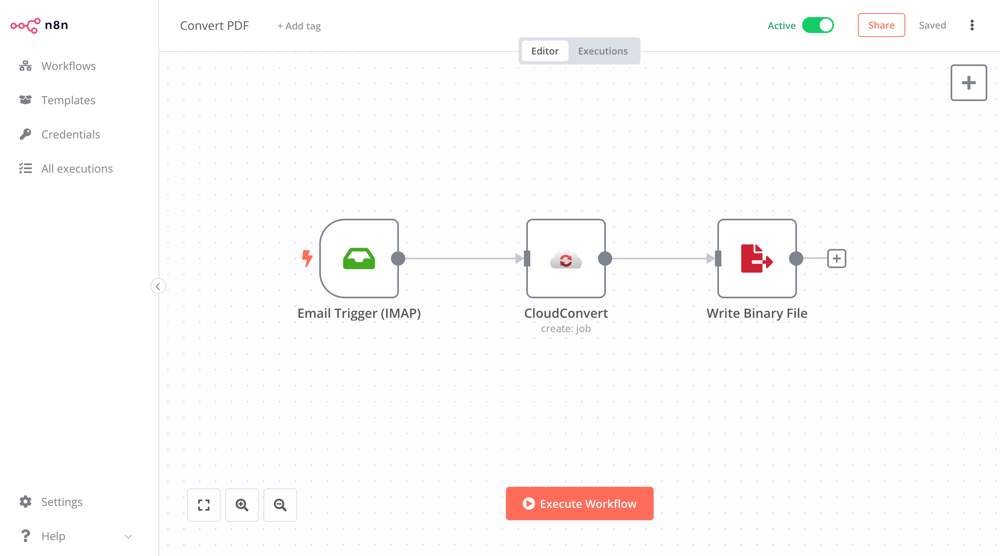
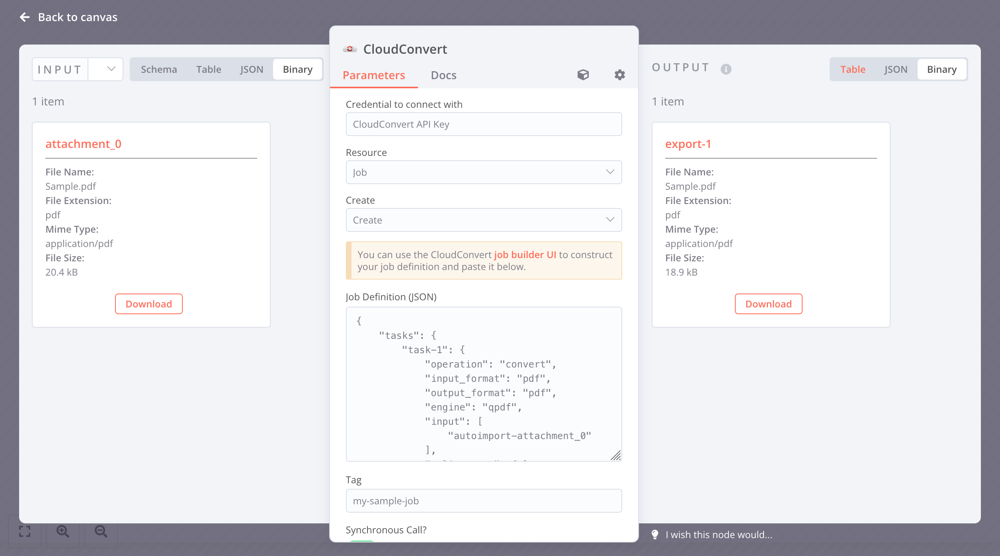

# n8n-nodes-cloudconvert

This is an n8n community node. It lets you use [_CloudConvert_](https://cloudconvert.com) in your n8n workflows.

[_CloudConvert_](https://cloudconvert.com) is an online service providing all sorts of file processing / transformation features, that can be used to convert or tweak PDFs, images, ebooks, audio, documents, etc...

[n8n](https://n8n.io/) is a [fair-code licensed](https://docs.n8n.io/reference/license/) workflow automation platform.

[Installation](#installation)  
[Operations](#operations)  
[Credentials](#credentials)  <!-- delete if no auth needed -->  
[Compatibility](#compatibility)  
[Usage](#usage)  <!-- delete if not using this section -->  
[Resources](#resources)  

## Installation

Follow the [installation guide](https://docs.n8n.io/integrations/community-nodes/installation/) in the n8n community nodes documentation.

## Operations

### Action Node

- Jobs:
  - Create (sync or async, with file upload / download options)
  - List
  - Get One
  - Delete

### Trigger Node

- Receive webhook (with file download option)

## Credentials

Authentication relies on an API key that you can generate from your CloudConvert [dashboard](https://cloudconvert.com/dashboard). Both live and [sandbox](https://sandbox.cloudconvert.com) environments are supported. You will likely need the `task.read` and `task.write` scopes.

## Compatibility

Tested on n8n 0.206.1

## Usage

### Sandbox Usage

Note that it's strongly recommended to perform your tests against the sandbox environment, which needs to be enabled first and which uses a separate API key. Note that:

- Separate credentials should be created for the live and sandbox environments.
- The main limitation of the sandbox environment is that all imported files need to be whitelisted first before processing (based on the file's `md5` hash).

### Job Definitions

The most useful operation is to send new conversion jobs to CloudConvert. The definition of each job is done in JSON format, and the [CloudConvert Job Builder UI](https://cloudconvert.com/api/v2/jobs/builder) can be used to build the job definition visually and interactively, and copy-paste the resulting JSON.

This node provides convenience methods to manipulate files, notably:

- There's an option to automatically upload binary attachments to the job (using an `import/base64` task - this task will be automatically added to the job definition, you won't need to specify it).
- There's an option to automatically download any resulting exported file (only the `export/url` tasks are supported).

Here's a sample workflow / node definition:

## Resources

- [n8n community nodes documentation](https://docs.n8n.io/integrations/community-nodes/)
- [CloudConvert API Docs](https://cloudconvert.com/api/v2)
- [The CloudConvert Visual Job Builder](https://cloudconvert.com/api/v2/jobs/builder#) which can be used to build the job definition JSON

## TODO

- Webhook operations
